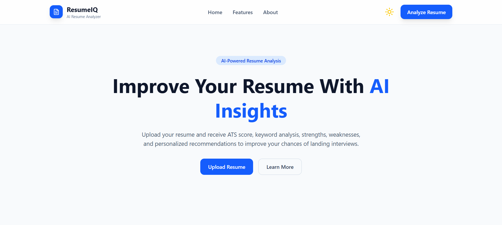
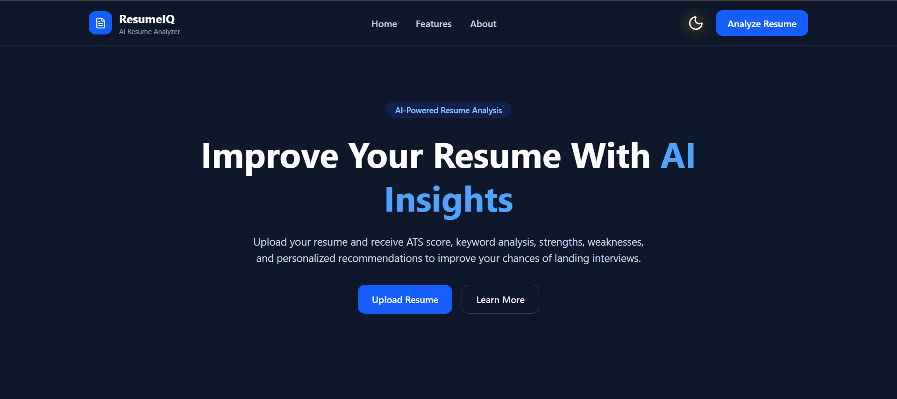
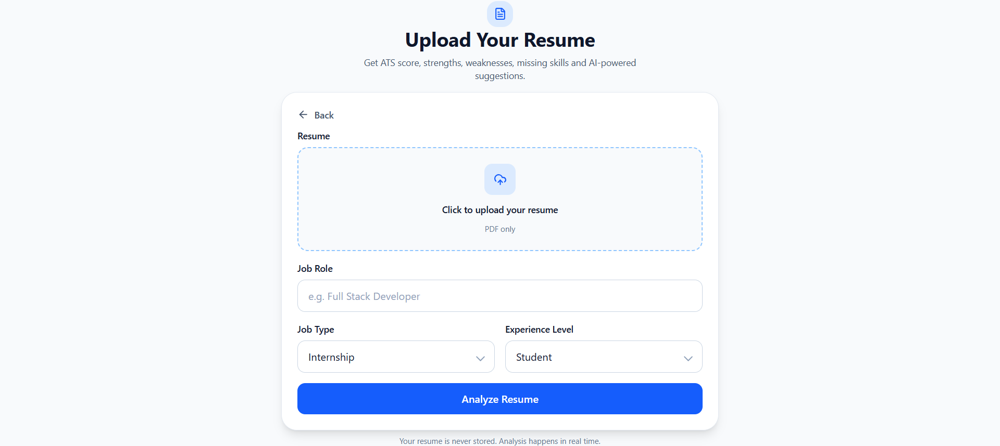
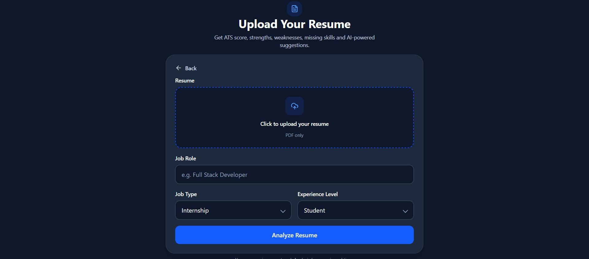
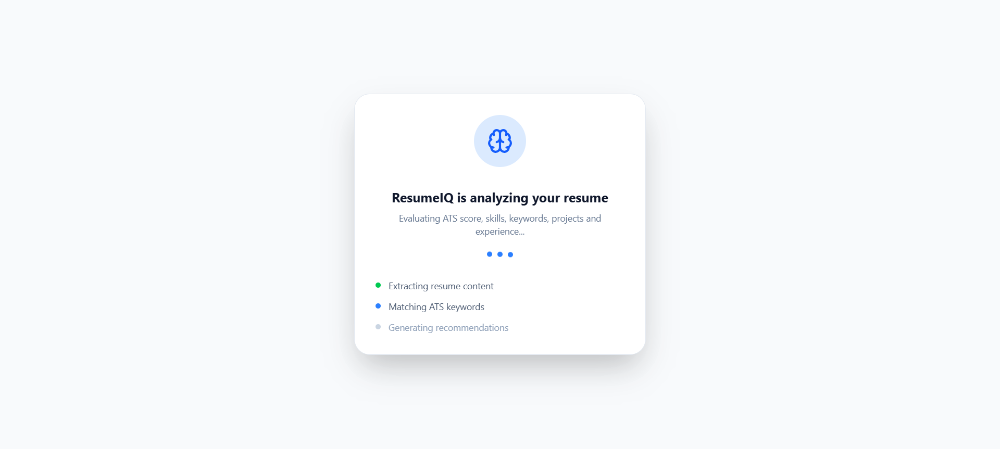
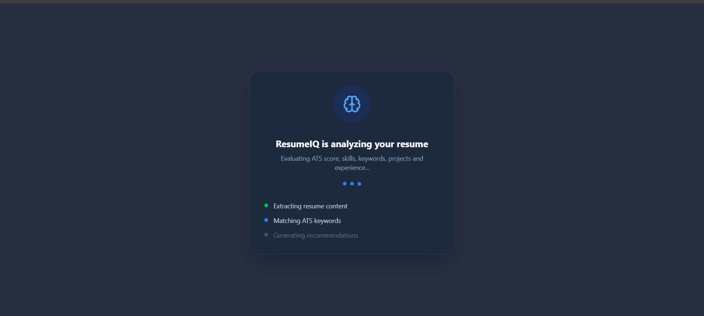
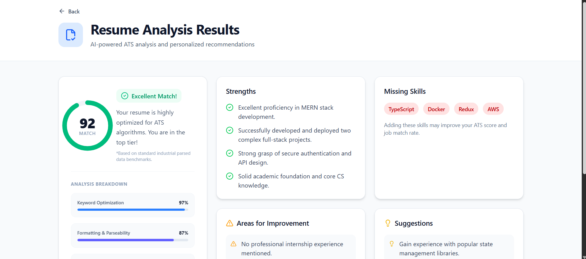
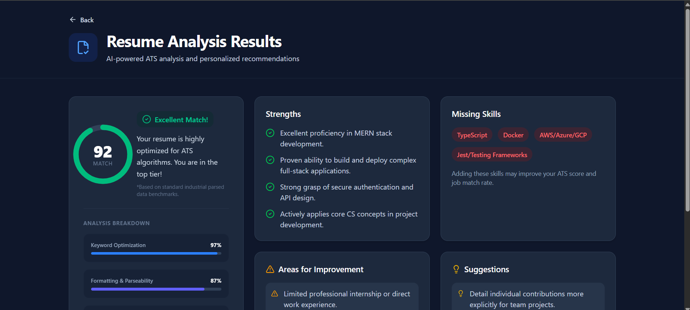

# 🧠 ResumeIQ

<div align="center">

### AI-Powered Resume Analyzer — ATS Score · Strengths · Gaps · Actionable Suggestions

<p align="center">
  
  
  
  
  
  
  
</p>

<p align="center">
  
  
  
  
  
  
</p>

<p align="center">
  
  
  
  
  
  
  
  
</p>

</div>

---

## 🌐 Live Demo

🔗 **Live Site:** https://resumeiq-insights.vercel.app

🔗 **GitHub Repository:** https://github.com/niteeshayadav/resumeiq

---

## 📖 About

Over **75% of resumes are filtered out by ATS software before a recruiter ever reads them.** Those that do reach a recruiter get an average of **6–8 seconds** of attention.

**ResumeIQ** was built to solve both problems.

Upload your PDF resume, specify your target role, job type, and experience level — and receive a full AI-powered breakdown in seconds. ResumeIQ calculates your ATS compatibility score, surfaces your strengths, identifies critical gaps, highlights missing skills, and delivers four concrete, actionable improvement steps — all powered by **Google Gemini 2.5 Flash**.

Your resume is **never stored or persisted.** Text is extracted in-memory and discarded immediately after analysis.

---

## ✨ Features

### 🤖 AI-Powered Resume Analysis
Leverages **Google Gemini 2.5 Flash** with structured prompt engineering to evaluate resume content against role-specific hiring benchmarks. Every analysis is grounded in your actual resume — no generic templates.

### 📊 ATS Compatibility Score (0–100)
Generates a score reflecting alignment with Applicant Tracking System filters for your target role, broken into three sub-metrics:
- **Keyword Optimization** — presence of role-relevant terms
- **Formatting & Parseability** — ATS readability and structure
- **Section Completeness** — coverage of expected resume sections

### 💪 Strength Detection
Identifies exactly **4 strengths** based on actual resume content — project quality, technical depth, certifications, and relevant experience.

### ⚠️ Weakness Analysis
Pinpoints exactly **4 critical gaps** such as missing quantified achievements, weak action verbs, vague project descriptions, or absent keywords.

### 🛠️ Missing Skills Detection
Cross-references your resume against the target role to surface **4 key technologies or skills** recruiters expect but couldn't find.

| Target Role | Example Missing Skills |
|---|---|
| Full Stack Developer | Docker · TypeScript · CI/CD · Redis |
| Backend Developer | System Design · gRPC · Kafka · PostgreSQL |
| Frontend Developer | a11y · Jest/RTL · Storybook · SSR |

### 🎯 Actionable Suggestions
Delivers **4 specific, implementable improvements** — each under 15 words and directly tied to resume weaknesses. No vague advice.

### 🎨 Role-Aware, Context-Sensitive Analysis
Every analysis is fully customized based on three inputs:

| Input | Options |
|---|---|
| **Job Role** | Any role — typed by the user |
| **Job Type** | Internship · Full-Time |
| **Experience Level** | Student · Fresher · 1–2 Years · 3–5 Years |

### 🌗 Light / Dark Mode
Full theme switching with Tailwind CSS v4 and persistent preference via `localStorage`.

### 📄 PDF-Only Upload with Size Validation
Secure in-browser PDF upload handled by **Multer** with MIME type enforcement and a **5 MB** file size cap. Zero disk writes — everything runs in-memory.

---

## 📸 Screenshots

> ResumeIQ supports full **Light & Dark mode** across every screen.

### 🏠 Landing Page

| ☀️ Light Mode | 🌙 Dark Mode |
|:---:|:---:|
|  |  |

---

### 📤 Resume Upload

| ☀️ Light Mode | 🌙 Dark Mode |
|:---:|:---:|
|  |  |

---

### ⏳ AI Analysis in Progress

| ☀️ Light Mode | 🌙 Dark Mode |
|:---:|:---:|
|  |  |

---

### 📊 Analysis Dashboard

| ☀️ Light Mode | 🌙 Dark Mode |
|:---:|:---:|
|  |  |

---

## 🏗️ Architecture

```
┌──────────────────────────────────────────────────────────────┐
│                       User (Browser)                         │
│              React 19 + Vite + Tailwind CSS v4               │
│                                                              │
│   Home.jsx  ──►  UploadResume.jsx  ──►  AnalyzeResume.jsx    │
│                  FormData (PDF + metadata)                    │
└──────────────────────────┬───────────────────────────────────┘
                           │  POST /api/resume/analyze
                           │  multipart/form-data
                           ▼
┌──────────────────────────────────────────────────────────────┐
│                    Express 5 Backend                         │
│                                                              │
│  upload.middleware.js  →  Multer (in-memory PDF buffer)      │
│  resume.controller.js  →  Orchestrates the pipeline          │
│                                                              │
│          ┌───────────────────┬──────────────────┐            │
│          ▼                   ▼                  │            │
│   pdf.service.js      gemini.service.js         │            │
│   (pdf-parse)         (Gemini 2.5 Flash)        │            │
│   Extract plain       Build structured          │            │
│   text from buffer    prompt + call API         │            │
│          │                   │                  │            │
│          └───────────────────┘                  │            │
│                     ▼                           │            │
│            Parse JSON response                  │            │
│            { atsScore, strengths,               │            │
│              weaknesses, missingSkills,         │            │
│              suggestions }                      │            │
└──────────────────────────┬───────────────────────────────────┘
                           │  JSON Response
                           ▼
┌──────────────────────────────────────────────────────────────┐
│                    Analysis Dashboard                        │
│                                                              │
│   ATSScoreCard.jsx   →  Circular progress + breakdown bars   │
│   StrengthsList.jsx  →  4 detected strengths                 │
│   WeaknessList.jsx   →  4 identified gaps                    │
│   MissingSkills.jsx  →  4 missing technologies               │
│   Suggestions.jsx    →  4 actionable improvements            │
└──────────────────────────────────────────────────────────────┘
```

---

## 🔄 How It Works

```
Step 1 — Upload
        User uploads a PDF resume and enters job role, type, and experience level.
        ⬇
Step 2 — Send to Backend
        Frontend sends FormData (PDF + metadata) to POST /api/resume/analyze.
        ⬇
Step 3 — Extract Resume Text
        Multer buffers the PDF in memory. pdf-parse extracts clean plain text.
        No file is written to disk.
        ⬇
Step 4 — Build Gemini Prompt
        gemini.service.js constructs a structured prompt with the resume text,
        role, job type, and experience level, instructing Gemini to return a
        strict JSON object with exact field names, types, and item counts.
        ⬇
Step 5 — Gemini AI Analysis
        Google Gemini 2.5 Flash processes the prompt with responseMimeType set
        to application/json — guaranteeing structured, parseable output.
        ⬇
Step 6 — Parse & Return
        Backend parses and validates the JSON, then returns it to the frontend.
        ⬇
Step 7 — Render Dashboard
        React renders the full analysis: ATS score card with circular progress,
        sub-metric breakdown bars, strengths, weaknesses, missing skills, suggestions.
```

---
## 🛠️ Tech Stack

### Frontend

| Technology | Purpose |
|---|---|
| React | UI framework |
| React Router DOM | Client-side routing |
| Tailwind CSS | Utility-first styling + dark mode |
| Vite | Build tool & dev server |
| Axios | HTTP client |
| Lucide React | Icon library |
| React Hot Toast | Toast notifications |

### Backend

| Technology | Purpose |
|---|---|
| Node.js | Runtime |
| Express | Web framework |
| Multer | In-memory multipart file upload |
| pdf-parse | PDF text extraction |
| Axios | Gemini API calls |
| dotenv | Environment variable management |
| CORS | Cross-origin request handling |

### AI

| Service | Purpose |
|---|---|
| Google Gemini (2.5 Flash) | Resume analysis + structured JSON generation |

### Deployment

| Service | Purpose |
|---|---|
| Vercel | Frontend hosting |
| Render | Backend hosting |

---

## 📂 Folder Structure

```
ResumeIQ/
│
├── Backend/
│   ├── server.js                        # Entry point — starts Express server
│   ├── .env                             # Environment variables (not committed)
│   ├── package.json
│   └── src/
│       ├── app.js                       # Express app, middleware setup, CORS config
│       ├── controllers/
│       │   └── resume.controller.js     # Request handler — orchestrates the pipeline
│       ├── middlewares/
│       │   └── upload.middleware.js     # Multer: in-memory buffer, PDF-only, 5MB cap
│       ├── routes/
│       │   └── resume.routes.js         # POST /api/resume/analyze
│       └── services/
│           ├── gemini.service.js        # Prompt engineering + Gemini API call
│           └── pdf.service.js           # PDF text extraction via pdf-parse
│
└── Frontend/
    ├── index.html
    ├── vite.config.js
    ├── package.json
    └── src/
        ├── App.jsx                      # Route definitions + dark mode state
        ├── main.jsx
        ├── index.css
        ├── components/
        │   ├── ATSScoreCard.jsx         # Circular SVG score + progress bars
        │   ├── StrengthsList.jsx        # 4 detected strengths
        │   ├── WeaknessList.jsx         # 4 identified weaknesses
        │   ├── MissingSkills.jsx        # 4 missing skills/technologies
        │   ├── Suggestions.jsx          # 4 actionable improvement steps
        │   └── Loader.jsx               # Full-screen loading indicator
        ├── pages/
        │   ├── Home.jsx                 # Landing page with dark mode toggle
        │   ├── UploadResume.jsx         # PDF upload + job context form
        │   ├── AnalyzeResume.jsx        # Analysis dashboard — results grid
        │   ├── Features.jsx             # Features overview page
        │   ├── About.jsx                # About page
        │   └── LearnMore.jsx            # Deep-dive information page
        └── services/
            ├── api.js                   # Axios instance with base URL
            └── resumeService.js         # uploadResume() API call
```

---

## 📊 API Reference

### `POST /api/resume/analyze`

Analyzes a PDF resume against a target job role using Gemini AI.

**Request** — `multipart/form-data`

| Field | Type | Required | Description |
|---|---|---|---|
| `resume` | File (PDF) | ✅ | PDF resume — max 5 MB |
| `jobRole` | String | ✅ | Target role (e.g. `"Full Stack Developer"`) |
| `jobType` | String | ✅ | `"Internship"` or `"Full-Time"` |
| `experience` | String | ✅ | `"Student"` · `"Fresher"` · `"1 - 2 Years"` · `"3 - 5 Years"` |

**Success Response** — `200 OK`

```json
{
  "success": true,
  "analysis": {
    "atsScore": 78,
    "strengths": [
      "Strong MERN stack project portfolio",
      "Clear technical skills section",
      "Relevant academic coursework listed",
      "Consistent resume formatting"
    ],
    "weaknesses": [
      "No quantified achievements in projects",
      "Missing testing experience",
      "Weak action verbs in bullet points",
      "No mention of deployment or DevOps"
    ],
    "missingSkills": ["Docker", "TypeScript", "CI/CD", "Jest"],
    "suggestions": [
      "Add measurable outcomes to every project bullet",
      "Include a testing tools section or project",
      "Replace weak verbs with built, engineered, reduced",
      "Mention deployment platforms like Vercel or Render"
    ]
  }
}
```

**Error Response** — `400 / 500`

```json
{
  "success": false,
  "message": "Please upload resume"
}
```

---

## ⚙️ Local Setup

### 1. Clone Repository

```bash
git clone https://github.com/niteeshayadav/resumeiq.git
cd resumeiq
```

### 2. Backend Setup

```bash
cd Backend
npm install
```

Create a `.env` file inside `Backend/`:

```env
PORT=3000
GEMINI_API_KEY=your_gemini_api_key_here
CLIENT_URL=http://localhost:5173
```

Run the backend:

```bash
# Development — auto-reload with nodemon
npm run dev

# Production
npm start
```

Server runs at: `http://localhost:3000`

### 3. Frontend Setup

```bash
cd ../Frontend
npm install
npm run dev
```

App runs at: `http://localhost:5173`

---

## 🔐 Environment Variables

| Variable | Required | Description |
|---|---|---|
| `PORT` | No | Server port (default: `3000`) |
| `GEMINI_API_KEY` | ✅ | Google Gemini API key |
| `CLIENT_URL` | No | Frontend origin for CORS (default: `http://localhost:5173`) |

---

## 🚧 Engineering Challenges

### Structured AI Output
LLMs can return unpredictable formats. Solved by setting Gemini's `responseMimeType` to `application/json` and writing a tightly constrained prompt specifying exact field names, types, and item counts — exactly 4 per category, each under 15 words, with no cross-section repetition.

### PDF Text Extraction Without Disk I/O
PDFs generated from Word, LaTeX, Canva, or scans produce inconsistent text layers. Solved using `pdf-parse` with Multer's in-memory buffer — the file never touches the file system, protecting user privacy and reducing infrastructure complexity.

### Privacy Without Authentication
The app handles sensitive resume data without user accounts. Solved by processing everything in-memory — no file system writes, no database, no session storage. The resume text is discarded immediately after the Gemini call completes.

### Consistent Score Tier Classification
ATS scores needed to map to meaningful feedback tiers without being arbitrary. Solved by defining four tiers with distinct visual treatment: Excellent (≥85, emerald), Good (≥70, blue), Needs Improvement (≥50, amber), and Critical (below 50, rose) — each with a unique icon, color scheme, and tailored description.

---

## 💡 Key Engineering Decisions

| Decision | Rationale |
|---|---|
| **No database** | Resume data is sensitive; zero-persistence removes an entire attack surface |
| **Gemini `application/json` MIME type** | Forces structured output without post-processing fragility |
| **Multer memory storage** | Avoids disk writes — faster, stateless, and privacy-safe |
| **Exactly 4 items per category** | Constrained AI output ensures consistent, scannable UI |
| **React Router v7 state passing** | Analysis data is passed via `location.state` — no URL params, no storage |
| **Express v5** | Async error propagation without explicit try-catch in every route |

---

## 🎯 Use Cases

**🎓 Students** — Prepare ATS-optimized resumes before campus placements and internship drives.

**👨‍💻 Freshers** — Identify and close skill gaps before applying to entry-level roles.

**💼 Professionals** — Tailor existing resumes to specific roles during career transitions.

**🧑‍🏫 Career Coaches** — Deliver faster, data-backed resume evaluations to clients.

---

## 👩‍💻 Author

**Panchadarla V Sai Niteesha Yadav**

B.Tech Information Technology · Andhra University College of Engineering

📧 Email: niteeshayadav66@gmail.com

🔗 LinkedIn: https://www.linkedin.com/in/niteeshayadav

💻 GitHub: https://github.com/niteeshayadav

---

<div align="center">

⭐ If you found this project useful, consider giving it a star!

**ResumeIQ** · Built to help candidates beat the bots and land interviews.

*Because your resume deserves more than 6 seconds.*

</div>

